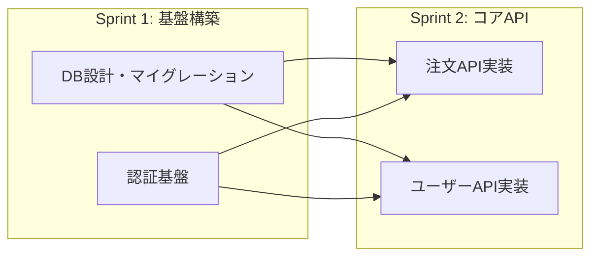

# 技術設計書からPBI / GitHub Issue分割プロンプト

## 概要

技術設計書を入力として、開発チームがスプリントプランニングで即座に使用できる粒度の
PBI（Product Backlog Item）/ GitHub Issue リストを生成するプロンプトです。

**入力**: 技術設計書（[spec-to-technical-design-prompt.md](spec-to-technical-design-prompt.md) の出力、または同等の技術仕様書）
**出力**: PBIリスト（Markdown + Mermaid依存関係図 + CSV）

## 使い方

1. 技術設計書をAIチャットに添付（またはペースト）
2. 以下のプロンプトをコピー＆ペースト
3. 出力されたPBIリストをチームでレビューし、調整

### 前提条件

- 入力となる技術設計書が作成・レビュー済みであること
- スプリント期間（デフォルト: 2週間）が決まっていること
- チームの開発メンバー数が概ね分かっていること

---

## プロンプト

以下をコピーしてそのまま使用してください。

```
あなたは、アジャイル開発に精通したプロダクトマネージャー兼テックリードです。

添付（またはペースト）された「技術設計書」を読み込み、
開発チームがスプリントプランニングで即座に使用できる粒度の
PBI（Product Backlog Item）/ GitHub Issue のリストを作成してください。

## 制約事項

* 出力はMarkdown形式。各PBIは独立したセクションとして記述。
* 1つのPBIは推定8SP以下が推奨。8SPを超える場合は分割を強く検討し、
  分割しない場合は理由を明記。13SP以上は必ず分割すること。
* PBIのスコープは「1つのPRで完結するか」を分割の判断基準に含めること。
* PBI間の依存関係を明示し、着手順序を提案すること。
* 技術設計書の各セクションとの対応関係（トレーサビリティ）を明記。
* 不確実性が高い領域には、実装PBIの前にスパイク（技術調査）PBIを作成すること。
* インフラ・CI/CD・監視設定など、機能開発以外のPBIも含めること（後述のチェックリスト参照）。
* セキュリティ基盤PBI（認証、認可、暗号化）は自動的にHigh優先度とすること。
* 技術設計書で `[推論補完]` と注記された箇所に基づくPBIには、
  `[要確認: ビジネス側との合意未了]` フラグを付与すること。
* 優先度は以下の2軸で判断し、混同しないこと:
  - **ビジネス優先度**（MoSCoW: Must/Should/Could/Won't）: ビジネス価値基準
  - **技術依存順序**: 依存関係に基づく着手順序

---

## 出力セクション

### 0. エグゼクティブサマリー

非技術者向けの全体概要を記述してください。

* **プロジェクト概要**: 1-2文で要約
* **規模**: 合計PBI数 / 合計SP / 推定スプリント数
* **主要リスク**: Top 3のリスクと緩和策
* **最速リリース見込み**: MVPリリース可能時期

---

### 1. PBI全体マップ

#### 1.1 PBI一覧サマリー

以下の形式で全PBIの一覧表を作成してください。

| PBI番号 | タイトル | ビジネス優先度 | 推定SP | 依存PBI | カテゴリ | MVPスコープ | 設計書対応セクション |
|---------|---------|---------------|--------|---------|---------|------------|-------------------|
| PBI-001 | [タイトル] | Must | 3 | - | Backend | MVP | 2. データモデル |
| PBI-002 | [タイトル] | Must | 5 | PBI-001 | Backend | MVP | 5. API定義 |

**カテゴリ種別**: Backend / Frontend / Infrastructure / Testing / Documentation / Spike / Security
**MVPスコープ**: MVP（必須）/ Post-MVP（改善）/ Nice-to-Have（将来）

#### 1.2 依存関係図

Mermaidの `graph LR` を使用して、PBI間の依存関係を可視化してください。
* クリティカルパス（最長経路）を特定し、太線で表現。合計SPと想定日数を記載。
* 並行開発可能なPBIグループをサブグラフで表現



#### 1.3 推奨スプリント配置

PBIを依存関係と優先度に基づいて、スプリント単位に配置してください。

| スプリント | PBI | 合計SP | 備考 |
|-----------|-----|--------|------|
| Sprint 1 | PBI-001, PBI-004 | 8 | 基盤構築フェーズ |
| Sprint 2 | PBI-002, PBI-003 | 10 | コアAPI実装 |
| Sprint 3 | PBI-005, PBI-006 | 8 | フロントエンド連携 |

※ チームのベロシティ情報があれば、各スプリントの合計SPがベロシティを超えないように調整すること。

#### 1.4 リリース計画提案

| リリース | 含まれるPBI | リリース可能条件 | ユーザーへの価値 |
|---------|-----------|----------------|----------------|
| MVP Release | PBI-001〜005 | Sprint 2完了時点 | [主要なユーザー価値] |
| v1.1 | PBI-006〜008 | Sprint 4完了時点 | [追加価値] |

---

### 2. PBI詳細

各PBIについて、以下のフォーマットで記述してください。
カテゴリに応じてDoDを使い分けること（後述のカテゴリ別DoD参照）。

---

#### PBI-XXX: [簡潔で具体的なタイトル]

**カテゴリ**: Backend / Frontend / Infrastructure / Testing / Documentation / Spike / Security
**ビジネス優先度**: Must / Should / Could / Won't（MoSCoW）
**推定ストーリーポイント**: X SP
**依存PBI**: PBI-YYY, PBI-ZZZ（依存がない場合は「なし」）
**技術設計書の対応セクション**: セクション X.X
**MVPスコープ**: MVP / Post-MVP / Nice-to-Have
**要確認フラグ**: なし / `[要確認: ビジネス側との合意未了]`

##### ユーザーストーリー
**[ペルソナ]** として、**[達成したいこと]** のために、**[機能/操作]** したい。
（技術基盤PBIの場合は「Enabler Story: [最終的にどのユーザーストーリーを実現するための前提か]」を記載）

##### 概要
[このPBIで実現すること、ビジネス価値の説明（2-3文）]

##### 受け入れ条件（Acceptance Criteria）

具体的なデータ状態・ユーザーアクション・検証可能な結果で記述すること。

- [ ] **Given** [具体的なデータ状態] **When** [具体的な操作] **Then** [検証可能な結果]
- [ ] **Given** [正常系の前提] **When** [操作] **Then** [成功結果]
- [ ] **Given** [異常系の前提] **When** [操作] **Then** [エラーハンドリング結果]
- [ ] **Given** [エッジケース] **When** [操作] **Then** [期待される振る舞い]
- [ ] パフォーマンス条件: [具体的な数値目標]（該当する場合）
- [ ] セキュリティ条件: [具体的な要件]（Backend/Frontend/Securityカテゴリの場合は必須）

##### 技術実装ヒント
* 使用する主要なクラス/モジュール/パッケージ
* 推奨する実装パターン（例: Repository Pattern, Event Sourcing等）
* 既存コードとの統合ポイント
* 注意すべき技術的な落とし穴

##### テスト要件
- [ ] **ユニットテスト**: [対象と主要テストケース（正常系1+異常系2以上）]
- [ ] **統合テスト**: [対象と検証ポイント]
- [ ] **E2Eテスト**: [シナリオ]（該当する場合）
- [ ] **セキュリティテスト**: [SAST/SCA結果クリア、認証認可テスト]（Backend/Security必須）
- [ ] **テストデータ**: [必要なテストデータの説明]

##### 影響範囲と回帰テスト
* このPBIにより影響を受ける可能性のある既存機能
* 実施すべき回帰テストの範囲

---

### カテゴリ別 Definition of Done（完了の定義）

PBIのカテゴリに応じて、適切なDoDを適用してください。

**Backend / Frontend:**
- [ ] コードが実装され、ユニットテストが通過している
- [ ] コードレビューが完了し、指摘事項が対応済み
- [ ] 受け入れ条件がすべて満たされている
- [ ] 統合テストが通過している
- [ ] 必要なドキュメント（APIドキュメント等）が更新されている
- [ ] セキュリティテスト（SAST/SCA）が通過している
- [ ] CI/CDパイプラインが正常に通過している

**Infrastructure:**
- [ ] 構成レビューが完了している
- [ ] Dry-Run検証が完了している
- [ ] ロールバック手順が確認されている
- [ ] 監視設定が動作確認されている
- [ ] デプロイ手順書が更新されている

**Spike（技術調査）:**
- [ ] 調査レポートが作成されている
- [ ] チームへの共有が完了している
- [ ] 次ステップ（後続PBIの作成/修正）が明確化されている

**Security:**
- [ ] 脅威シナリオに対する防御が実装されている
- [ ] セキュリティテスト（SAST/DAST）が通過している
- [ ] セキュリティレビューが完了している
- [ ] 攻撃シナリオに基づくテストケースが実装されている
- [ ] CI/CDパイプラインが正常に通過している

---

### 3. ストーリーポイント見積もりガイダンス

以下の基準を参考に、各PBIのストーリーポイントを見積もってください。

| SP | 複雑度 | 工数参考 | 具体例 |
|----|--------|---------|--------|
| 1 | 非常に小さい | 数時間 | 設定変更、文言修正、定数追加 |
| 2 | 小さい | 半日〜1日 | 単一CRUDの一部、バリデーション追加、簡単なテスト |
| 3 | 中程度 | 1〜2日 | 単一APIエンドポイント実装、シンプルなUI画面 |
| 5 | やや大きい | 2〜4日 | 複数テーブルにまたがる機能、複雑なビジネスロジック |
| 8 | 大きい | 1週間程度 | 複雑なビジネスロジック + テスト + ドキュメント |
| 13 | 非常に大きい | → **必ず分割** | |

※ 工数参考はチームのベロシティで変動する参考値であり、SPとの固定的な換算ではありません。

**見積もり時の考慮事項**:
* 不確実性が高い場合はポイントを上振れさせる
* 技術的負債の解消が含まれる場合はその分を加算
* テストコードの工数を含めること（実装の30-50%が目安）
* レビュー・修正の工数も考慮すること

---

### 4. リスクと依存関係の分析

#### 4.1 技術的リスク

| PBI | リスク内容 | 影響度 | 発生確率 | 緩和策 |
|-----|-----------|--------|---------|--------|
| PBI-XXX | [リスク] | High/Medium/Low | High/Medium/Low | [対策] |

#### 4.2 外部依存

* **他チームへの依存**: API提供待ち、デザイン確定待ち、環境構築待ち等
* **外部サービスの契約・設定**: サードパーティAPI、インフラリソース等
* **ブロッカーになりうる項目**: 各項目の解消見込み時期

#### 4.3 スパイク（技術調査）PBI

不確実性が高い領域について、実装PBIの前に完了すべき調査PBIを提案してください。

| スパイクPBI | 調査対象 | 期待するアウトプット | 推定SP |
|------------|---------|---------------------|--------|
| SPIKE-001 | [調査内容] | [判断材料となる成果物] | 2-3 |

#### 4.4 スケジュールリスクと代替戦略

| クリティカルパスPBI | 遅延時の影響 | 代替戦略（スコープ縮小案等） |
|-------------------|------------|--------------------------|
| PBI-XXX | [影響範囲] | [フォールバック案] |

---

### 5. インフラ・セキュリティPBI漏れ防止チェックリスト

以下の項目について、PBIの必要性を判断し、必要なものは必ず生成すること。

**インフラ:**
- [ ] 開発/ステージング/本番環境の構築・設定
- [ ] CI/CDパイプラインの構築・修正
- [ ] データベーススキーマのマイグレーション実行環境
- [ ] 監視ダッシュボードの作成
- [ ] アラートルールの設定
- [ ] ログ集約・検索基盤の設定
- [ ] バックアップ・リカバリ設定
- [ ] Feature Flagプラットフォームの設定（該当する場合）

**セキュリティ（Sprint 1に配置推奨）:**
- [ ] 認証・認可基盤の構築
- [ ] セキュリティテスト基盤（SAST/DAST/SCA）のCI/CD統合
- [ ] セキュリティヘッダー・CORS設定
- [ ] 監査ログ基盤の構築
- [ ] シークレット管理の設定

---

### 6. GitHub Issue一括登録用フォーマット（オプション）

GitHub CLIやProject管理ツールで一括登録できる形式でも出力してください。

#### 6.1 CSV形式

```csv
Title,Body,Labels,Milestone
"PBI-001: [タイトル]","## ユーザーストーリー\n[ストーリー]\n\n## 概要\n[概要]\n\n## 受け入れ条件\n- [ ] [条件1]","backend,priority:must,mvp","Sprint 1"
```

#### 6.2 GitHub CLI コマンド例

```bash
# PBI-001の作成例
gh issue create \
  --title "PBI-001: [タイトル]" \
  --body "$(cat <<'EOF'
## ユーザーストーリー
[ストーリー]

## 概要
[概要]

## 受け入れ条件
- [ ] [条件1]
- [ ] [条件2]

## テスト要件
- [ ] [テスト1]

## Definition of Done
- [ ] コードレビュー完了
- [ ] テスト通過
- [ ] ドキュメント更新
EOF
)" \
  --label "backend" \
  --label "priority:must" \
  --label "mvp" \
  --milestone "Sprint 1"
```
```

---

## オプション: マルチパースペクティブ評価

上記で生成されたPBIリストを、以下の5つの視点でセルフレビューしてください。

```
上記のPBIリストを、以下の5つの専門家の視点でレビューし、
各視点ごとに Good（良い点）/ Concern（懸念点）/ Missing（不足）を指摘してください。

1. **シニアバックエンドエンジニア**: PBIの粒度は適切か、技術ヒントは実装に十分か、カテゴリ別DoDは妥当か
2. **QAエンジニア**: ACがGiven-When-Thenで具体的か、テスト要件の粒度は十分か、回帰テスト範囲は妥当か
3. **プロダクトマネージャー**: MVPスコープは適切か、ユーザーストーリーはビジネス価値を反映しているか、リリース計画は実現可能か
4. **セキュリティエンジニア**: セキュリティPBIの優先度は適切か、セキュリティACは十分か、SAST/DAST PBIは含まれているか
5. **DevOps/SREエンジニア**: インフラPBIは網羅されているか、監視設定PBIがあるか、ロールバック手順は考慮されているか
```

---

## 関連プロンプト

- [spec-to-technical-design-prompt.md](spec-to-technical-design-prompt.md) — 技術設計書の生成プロンプト（このプロンプトの前工程）
